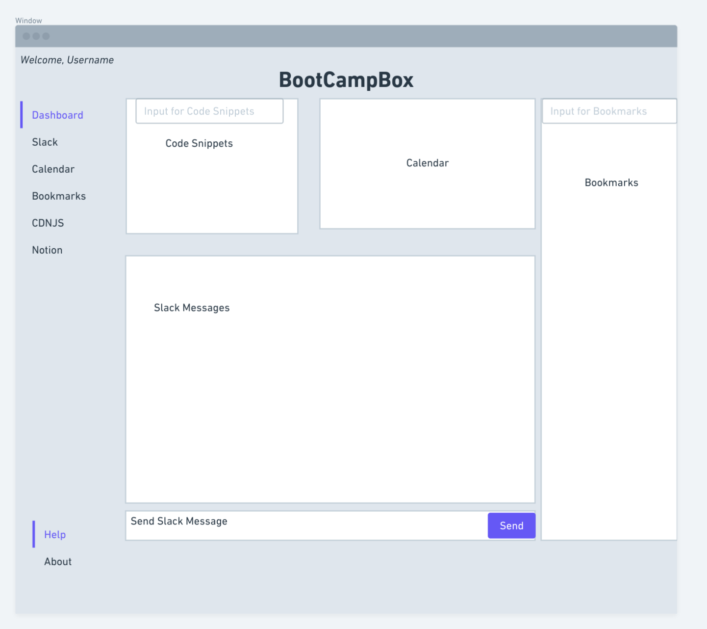
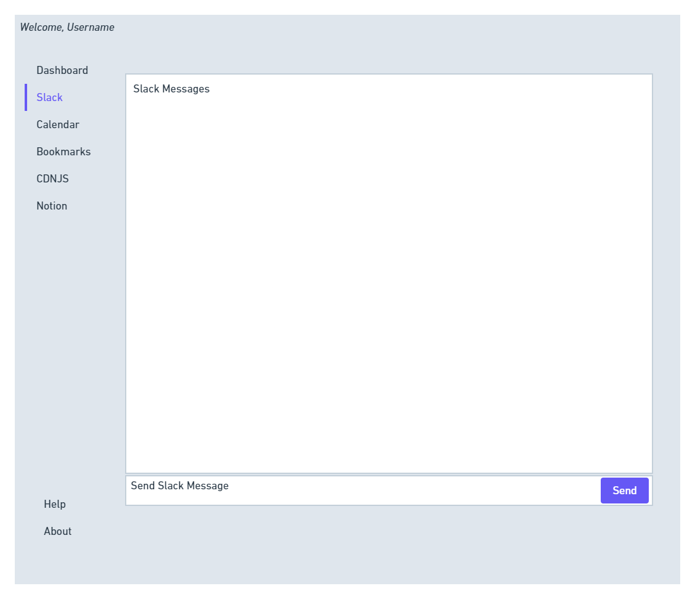
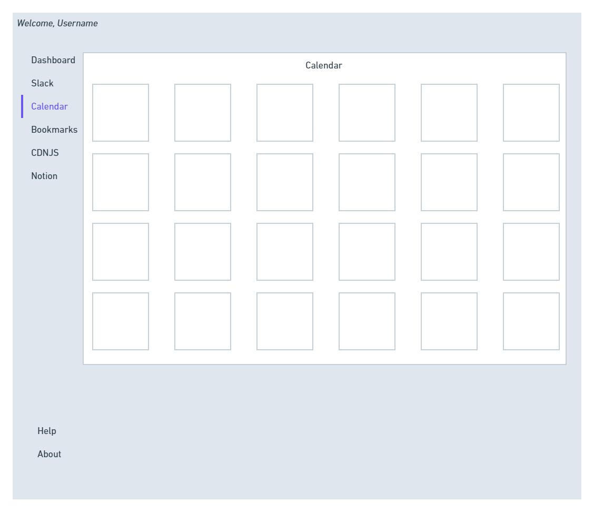
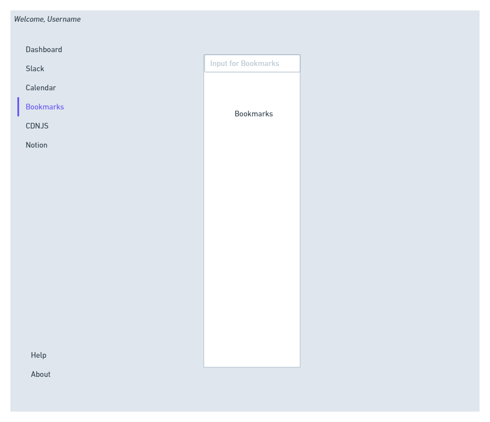

# BootCampBox

## Application Description:

A helpful dashboard for use in a web-development environment. Integrates multiple links, sites, and tools that are frequently used within a web-development lifestyle.

## User Story:

## GitHub URL:
https://github.com/BootcampBox/BootCampBox.git

Screenshots:

### Wireframe

### Deployed Application URL:
https://bootcampbox.github.io/BootCampBox/

## Works Cited:

### CSS Libraries 

---

[Link to Materialize](https://www.materializecss.com)

[Link to UIKit](https://getuikit.com)

[Link to DayPilot.js](https://www.daypilot.org/)

---

### Application Authors:

[Joseph Sumis](https://github.com/JSumis)

[Gerald Plotke](https://github.com/GPLOTKE)

[Rauol Moore](https://github.com/rudie-g)

[Peter Roto](https://github.com/Proto133)

### BootCampBox Working Agreement

1. Disagreements to be handled by vote.
   - In the event of a tie, the criteria will come down to quality of existing code.
  
2. Work whenever you are free and we will use slack to orchestrate group meetings (probably before or after class)
3. Each contributor is repsonsible for ensuring that they are contributing in both quantity and quality which directly correlates with the other members of the group.