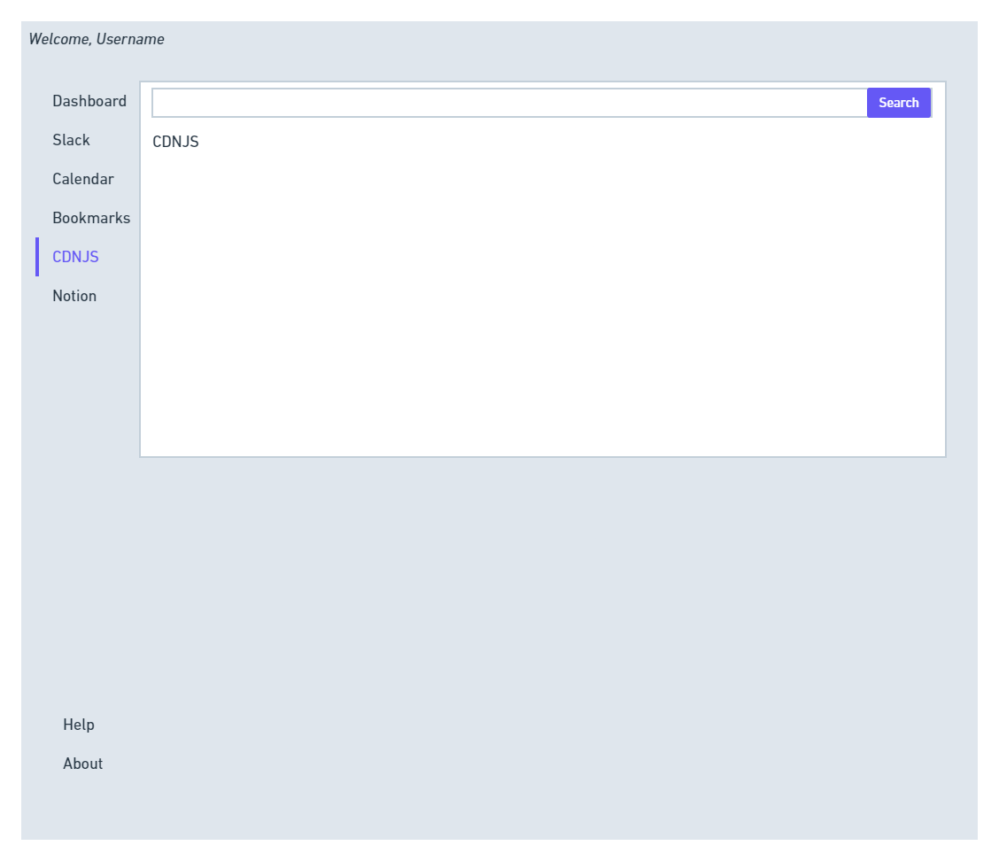
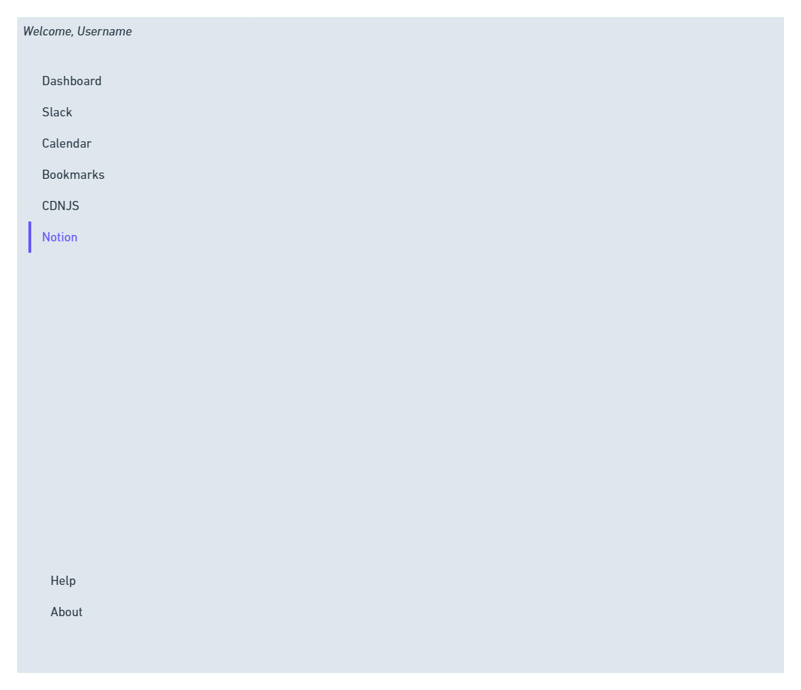

# BootCampBox

## Application Description:

A helpful dashboard for use in a web-development environment. Integrates multiple links, sites, and tools that are frequently used within a web-development lifestyle.

## User Story:
AS A bootcamp student,
I WANT to see a web application that combines some of the most used web development resources in one convenient place.
SO THAT I can reduce the amount of open tabs and windows.
Acceptance Criteria
GIVEN a dashboard
WHEN I open the app,
THEN I can Sign Up and create  a user account that saves my name, email address, and password.
WHEN I click Login,
THEN I can enter my email and password.
WHEN I view the Dashboard,
THEN I am presented with the current date/time and places to enter and save Code Snippets and Links to local storage.
WHEN I click GitHub on the navbar,
THEN I am presented with a search for GitHub.
WHEN I click CDNJS on the navbar,
THEN I am presented with a search function for CDNJS.
WHEN I click Calendar on the navbar,
THEN I am presented with a weekly planner that saves to local storage.
WHEN I click About on the navbar,
THEN I am presented with a window about the application and contributors.

## GitHub URL:
https://github.com/BootcampBox/BootCampBox.git

Screenshots:

### Wireframe

### Deployed Application URL:
https://bootcampbox.github.io/BootCampBox/

## Works Cited:

### CSS Libraries 

---

[Link to Materialize](https://www.materializecss.com)

[Link to UIKit](https://getuikit.com)

[Link to DayPilot.js](https://www.daypilot.org/)

---

### Application Authors:

[Joseph Sumis](https://github.com/JSumis)

[Gerald Plotke](https://github.com/GPLOTKE)

[Rauol Moore](https://github.com/rudie-g)

[Peter Roto](https://github.com/Proto133)

### BootCampBox Working Agreement

1. Disagreements to be handled by vote.
   - In the event of a tie, the criteria will come down to quality of existing code.
  
2. Work whenever you are free and we will use slack to orchestrate group meetings (probably before or after class)
3. Each contributor is repsonsible for ensuring that they are contributing in both quantity and quality which directly correlates with the other members of the group.